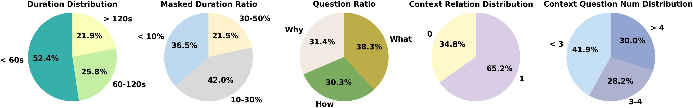

<h2 align="center"> Looking Beyond Visible Cues: Implicit Video Question Answering via Dual-Clue Reasoning </a></h2>

## 📊 I-VQA Dataset
Our I-VQA dataset includes 5,549 QA samples, where 3,749 samples are for the training set and 1,800 samples are split into the test set.



The annotations of training set: `dataset/NExT-GQA/ICR/training_4k.json`.

The annotations of testing set:  `dataset/NExT-GQA/ICR/test_mc.json`.

The videos can be found in Next-GQA, E.T. Bench, and REXTIME according to our provided video ID.

Details:

"duration": explicit evidence (mask during I-VQA task)

"context": context qa pairs

"action_relation_intent": clues generated by GPT-4o

"context_relation": the relation between context clues and current implicit question (1 for related, 0 for unrelated)


## 🔥 Training & Validating 
For training and our validating IRM(Implicit Reasoning Model), please follow the command below:
```bash 
cd Implicit_reasoner
OMP_NUM_THREADS=2 torchrun --nnodes=1 --nproc_per_node=8 tasks/train_it.py ./scripts/videochat_mistral/config_7b_stage3.py
```

## 🗝️ Validating
for IRM validating, we load the ckpoint at 24epochs.
I-VQA multi-choice
```bash
cd Implicit_reasoner
python inference_icr_mc.py
```

I-VQA open-ended
```bash
cd Implicit_reasoner
python inference_icr_open.py
```
The results of our IRM are provided in the json file `Implicit_reasoner/result/IRM_test_mc.json` and `Implicit_reasoner/result/IRM_test_open.json`. And the gpt-score/judging script is provided in `Implicit_reasoner/eval_GPT_score.py`.

SUTD-Traffic
```bash
cd Implicit_reasoner
python inference_icr_traffic.py
```
The utilized SUTD-Traffic QA samples: `dataset/SUTD-traffic/filtered_data2.json`

PSAV
```bash
cd Implicit_reasoner
python inference_icr_ads.py
```
The utilized PSAV samples: `dataset/ads/converted_annotation.json`

Other models Implicit-VQA multi-choice:
```bash
cd Implicit_reasoner
python inference_gpt4o_mc.py
python inference_o3_mc.py
python inference_r1_mc.py
```

Other models Implicit-VQA open-ended:
```bash
cd Implicit_reasoner
python inference_gpt4o_open.py
python inference_o3_open.py
python inference_r1_open.py
```

## 🛠️ Requirements and Installation
First, you will need to set up the environment.
We offer an environment suitable for IRM:
```bash
conda create -n irm python=3.10
conda activate irm
cd Implicit_reasoner
pip install -r requirements.txt
```


### ⏳ Ongoing
We will continue to update the performance of new state-of-the-art (SOTA) models on the I-VQA dataset.